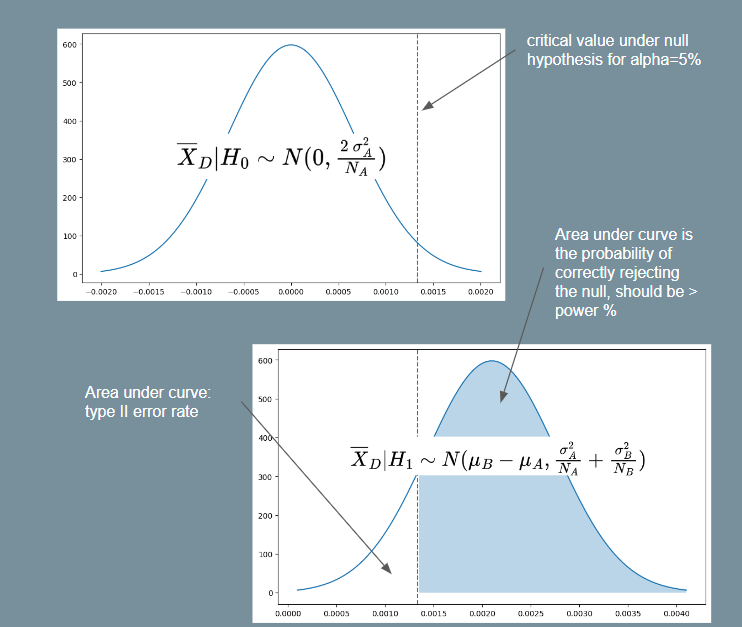

# Power Analysis

Reference: [Probing into Minimum Sample Size by Mintao Wei](https://towardsdatascience.com/probing-into-minimum-sample-size-formula-derivation-and-usage-8db9a556280b)

How to determine the minimum sample size required to achieve a certain significance level and power desired?

The following table helps us understand how type I and type II errors come into play:

| | Null Hypothesis: A is True | Alternate Hypothesis: B is True |
|:------:|:-------:|:--------:|
|Reject A| Type I Error | Good statistical power |
|Accept A| Good significance level | Type II Error |

<Type I Error> refers to rejecting the null hypothesis when it is actually true, e.g. when we think that an AA test has significant difference. In short, it means we were <too eager to deploy a poor variant>. This should happen with probability $\alpha$, which is the significance level which we set (typically 5%). We have a better handle on type I error because the baseline conversion rate is typically known prior to an experiment. 

<Type II Error> refers to failing to reject the null hypothesis when the alternate is actually true, i.e. we failed to get a significant effect on an improvement that is *known* to be better. In short, we were <too conservative and failed to deploy a winning variant>. In order to reason about type II error, we need to make a guess on what is the distribution of test variant `B`. Typically, this is done by assuming a minimum effect $\delta$ we wish to detect, and setting $\mu_B = \mu_A + \delta$, and re-using the standard deviation from `A`. With these assumptions in place, we use $power = 1-\beta$ to determine the type II error that should only occur with probability $\beta$ (typically 20%). Note that since $\delta$ is the *minimum* effect we wish to detect, if the actual effect turned out to be larger, the type II error can only be smaller than our desired amount, which is ok.

Now we can derive the formula for the minimum sample size required to achieve the desired levels of type I and type II error respectively.

Let us define the baseline conversion rate as $p$, and the minimum relative detectable effect rate as $d$. Consequently, the minimum detectable delta is $\delta = d \times p$. Let the desired power level be $1-\beta$, and the desired significance level as $\alpha$. Assume the scenario where we are running an AA or AB test with two variants of sample size $N$ each.

Firstly, we write down the distribution of the sample mean difference supposing we knew the true population means and standard deviations. Let $\mathbb{E}(X_A) = \mu_A, Var(X_A) = \sigma_A^2$ and $\mathbb{E}(X_B) = \mu_B, Var(X_B) = \sigma_B^2$. Note that $X_A, X_B$ may have arbitrary distributions, e.g. they could measure proportions, revenue etc.

Under the central limit theorem, the sample means will be distributed like so with $N_A, N_B$ samples: $\bar{X}_A \sim N \left( \mu_A, \frac{\sigma_A^2}{N_A} \right)$, $\bar{X}_B \sim N \left( \mu_B, \frac{\sigma_B^2}{N_B} \right)$. Importantly, the difference of the sample means will have the distribution below. Note that we add the variances together because $Var(B-A) = Var(B) + Var(A)$ for any two independent random variables $A, B$.

$$
\begin{align}
    \bar{X}_{D} = \bar{X}_B - \bar{X}_A \sim N \left( \mu_B - \mu_A, \frac{\sigma_A^2}{N_A} + \frac{\sigma_B^2}{N_B} \right)
\end{align}
$$

Now we can start working from the desired $\alpha, \beta$ levels to the minimum sample size. We need to ensure that both objectives below are achieved with our sample size $N_A,N_B$:
1. Assuming null hypothesis to be true, ensure that type I error $\leq \alpha$.
2. Assuming alternate hypothesis to be true, ensure that type II error $\leq 1 - \beta$.

Let us define some notation first.
- Let $z(\phi)$ denote the critical value under the standard normal distribution such that $P(Z \leq z(\phi)) = \phi$. This is basically the `scipy.stats.norm.ppf` function, e.g. $z(0.975) = 1.96$. 
- We also want to denote the critical value under the distribution $\bar{X}_D$ of the sample mean difference under the null or alternate hypothesis (these are non-standard normal distributions). Let these be $z_{\bar{X}_D | H_0}(\phi)$ and $z_{\bar{X}_D | H_1}(\phi)$ respectively.

|  |
| :--: |
| Illustration for Power Analysis Derivation |

For objective 1, assuming the null hypothesis and using equation (1) above, we have $\bar{X}_D | H_0 \sim N(0, \frac{2\ \sigma_A^2}{N_A})$. Since $\alpha$ is a two-tailed probability and we want the critical region on the right-side, let $\alpha' = 1 - \alpha / 2$. E.g. $\alpha=0.05$ implies $\alpha'=0.975$. Then:

$$
\begin{align}
    z_{\bar{X}_D | H_0}(\alpha') = z(\alpha') \cdot \sqrt{\frac{2\ \sigma_A^2}{N_A}}
\end{align}
$$

Note that equation (2) above tells us the critical value such that we will reject the null hypothesis if the sample mean of $B$ is greater than this value. To satisfy objective 2, we must thus ensure that the probability of rejecting the null hypothesis is at least $power = 1-\beta$. In other words, we want $\delta - z_{\bar{X}_D | H_1}(1-\beta) \geq z_{\bar{X}_D | H_0}(\alpha')$. Assuming the alternate hypothesis and again using equation (1), we have $\bar{X}_D | H_1 \sim N(\delta, \frac{\sigma_A^2}{N_A} + \frac{\sigma_B^2}{N_B})$. So then:

$$
\begin{align*}
    \delta - z_{\bar{X}_D | H_1}(1 - \beta) &\geq z_{\bar{X}_D | H_0}(\alpha')\\
    \delta - z(1-\beta) \times \sqrt{\frac{\sigma_A^2}{N_A} + \frac{\sigma_B^2}{N_B}} &\geq z(\alpha') \times \sqrt{\frac{2\ \sigma_A^2}{N_A}}\\
\end{align*}
$$

For the purpose of getting a minimum $N$, we assume $N = N_A = N_B$. Then using this and squaring both sides with some rearranging gives us:

$$
\begin{align}
    N &\geq \frac{\left( z(1-\beta) \sqrt{\sigma_A^2 + \sigma_B^2} + z(\alpha') \sigma_A \sqrt{2} \right)^2}{\delta^2}\\
\end{align}
$$

Which gives us the required minimum sample size equation. If we assume $\sigma_A = \sigma_B$, as is often assumed because we do not know the variance of the treatment, then it simplifies to the following form (as seen in [Ron Kohavi's paper](https://drive.google.com/file/d/1oK2HpKKXeQLX6gQeQpfEaCGZtNr2kR76/view)).

$$
\begin{align}
    N &\geq \frac{2 \sigma_A^2 \cdot \left( z(1-\beta) + z(\alpha')\right)^2}{\delta^2}\\
\end{align}
$$

## Bernoulli Events

The equation (3) above for the minimum sample size requires us to know the standard deviation under the null and alternate hypotheses. Usually, the standard deviation under the null is computed from historical data, and it is assumed that $\sigma_A = \sigma_B$. However, if the event we are interested in may be represented as a bernoulli random variable (e.g. an impression is shown and user either clicks or does not click with some probability), the equation may be simplified.

Specifically, the variance of a bernoulli random variable with probability $p$ is $p \cdot (1-p)$. Thus, if $X_A \sim Bernoulli(p_A)$, then $Var(X_A) = p_A \cdot (1-p_A)$, and likewise for $X_B$. 

So we can use $\sigma_A = \sqrt{p_A \cdot (1-p_A)}$ and $\sigma_B = \sqrt{(p_A + \delta) \cdot (1- p_A - \delta)}$ and substitute these into equation (3). We will then be able to have a minimum sample size formula by just specifying $\alpha$, $\beta$, baseline conversion $p_A$ and minimum relative difference $d$. This is the formula used by [Evan Miller's sample size calculator](https://www.evanmiller.org/ab-testing/sample-size.html).

