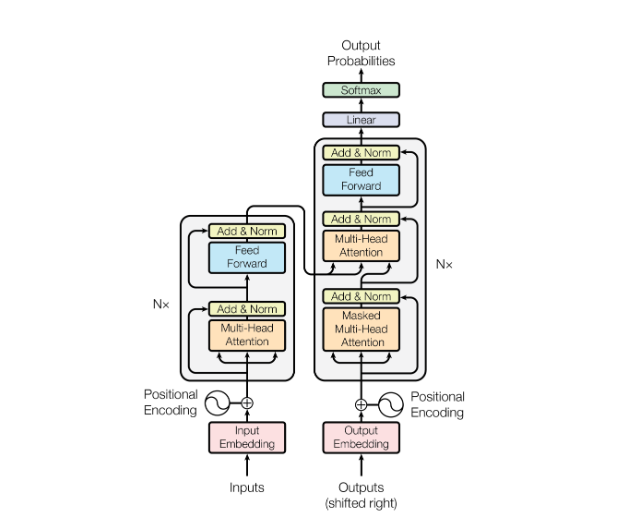

# Encoder vs Decoder

There are broadly two categories of LLMs: <<Encoder-Decoder>> architecture (typified by BERT) and <<Decoder only>> architecture (typified by GPT-2 series). There are some innate differences between the two that affect the type of application each is well suited for.

## Encoder-Decoder Architecture

The Encoder-Decoder architecture was proposed in the original [Attention is All You Need paper by Vaswani et al](https://ar5iv.labs.arxiv.org/html/1706.03762). As the name suggests, there is a separate encoder and decoder module. The design choice of two distinct modules is easier to understand when we consider that the original paper was designed for the machine translation task, such that the inputs may be in English and the outputs may be in French.

On the encoder-side, the encoder module sees the full input sequence and encodes it into an numeric encoding representation matrix of size `(seq_len, embed_dim)`. There is no input masking required because we assume we see the full English text before we begin translation. This encoding representation is passed to the decoder module as context.

On the decoder-side, we cannot allow the decoder module to see the full output sequence during training, since that would cause data leakage and the model to collapse. Note that the decoder simultaneously (in one forward pass) predicts a token for each position in the output sequence during training. Hence to avoid data leakage, <<causal masking>> is applied such that for each position being predicted, the decoder module is only allowed to "see" tokens in previous positions. 

Note that this can be implemented simply by masking the attention matrix in each self-attention block in a triangular manner. The feedforward layers only map information from position `i` to position `i`, so there is no need to adjust that.

|  |
| :--: |
| BERT Encoder Decoder Architecture (From Attention is All You Need) |

The decoder module itself creates a representation of the output sequence (with causal masking) of size `(seq_len, embed_dim)`. Now for the tricky part of merging the encoder and decoder representations. Naively, we can simply concatenate the two to form a representation of `(seq_len x 2, embed_dim)`, and add further self-attention blocks (with appropriate causal masking). However, this would increase the number of parameters of the model.

The paper instead chose to take the `Q` matrix from the *decoder* and the `K, V` matrices from the *encoder*. Since the attention mechanism is $softmax(Q \cdot K^T)V$, this allows every token on the decoder representation to attend to every token on the encoder representation. The result is a weighted combination of the `V` vectors taken from the encoder representation which is eventually used to generate the tokens for each decoder position.

Here we can already observe some *inductive biases* baked into the encoder-decoder architecture. These comments are inspired by / taken from [Hyung Won Chung's lecture](https://www.youtube.com/watch?v=orDKvo8h71o):
1. There is a <<clear distinction between the tokens on the encoder-side and the decoder-side>>, such that tokens on either side cannot directly attend to each other until the final block when the mixing happens. This may be suitable for the translation task but not for generic chat completion, where it is quite arbitary which point in the conversation we determine as the encoding and which point we determine as the decoding.
2. The `V` matrix is taken entirely from the encoder-side, which may again <<limit the expressiveness>> of the model (what if there are important tokens on the decoder-side that would be useful to taken the `V` values from?). One may argue that in translation, the tokens on the encoder-side capture the full meaning of the sentence to be translated, so it is comprehensive. But the same is not true of generic chat completions.
3. The separation of an encoder and decoder module suggests that there is significant difference between the tokens on the encoder-side and decoder-side. Again, this inductive bias 
