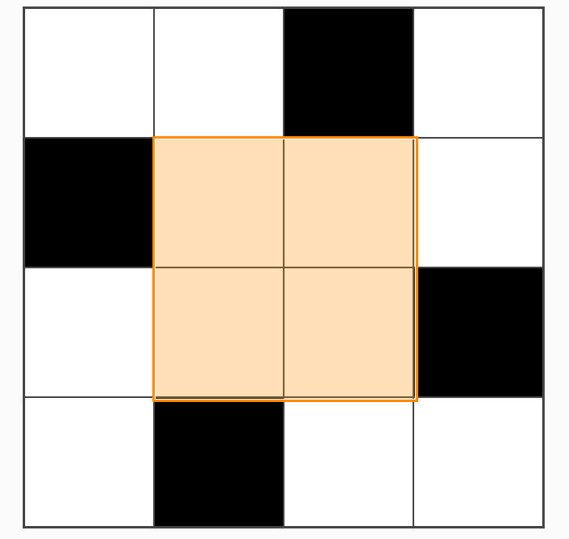

# IMO 2025 Q6

> **Q6**: Consider a 2025×2025 grid of unit squares. Matilda wishes to place on the grid some rectangular tiles, possibly of different sizes, such that each side of every tile lies on a grid line and every unit square is covered by at most one tile.
> 
> Determine the minimum number of tiles Matilda needs to place so that each row and each column of the grid has exactly one unit square that is not covered by any tile.

This is an interesting problem with a surprising solution. It's also an easy problem to understand and think about in your head (though certainly not easy to solve!). I have an interactive visualization at [https://charleslow.github.io/grid_visualization](https://charleslow.github.io/grid_visualization) to explore this problem.

## Initial Attempt

The first instinct is to take an approach like below. That is, we observe that using single row / column rectangular tiles is sufficient to tile the grid. Hence the solution uses $2(n-1)$ tiles if the grid is $n \times n$. It's $n-1$ instead of $n$ because of the gaps (black squares) up against the grid boundaries. I thought this was the solution initially, and tried to prove it but failed.

<figure style="max-width:320px;margin:1.25rem auto;padding:0 1.5rem;text-align:center;">
  
  <figcaption style="font-size:0.85rem;color:#555;margin-top:0.4rem;">Figure: A naive approach.</figcaption>
</figure>

## My Solution

Let's draw a vertical and horizontal line from each uncovered square (call it a "<<gap>>"). Observe there may be `2-4` such lines emanating in the NSEW directions from each gap. Overall, there would be $4n-4$ such lines ($-4$ because there is no line at the first & last row / column). Let's call each of these lines a "<<half-line>>". 

Since each `row, col` pair has one gap, we are assured that a tiling that covers all the half-lines satisfies Matilda (as it will then cover every row and column, except for the gaps).

Now the question is, how quickly can we cover the $4n-4$ half-lines with a minimal number of tiles? In other words, how many half-lines can we clear with each tile we introduce?

Now, it is tricky to analyze the number of lines we clear on each turn, because it depends on the preceding steps. For example, if we had cleared all but one remaining tile on each half-line (show example), then the next step can clear a large number of half-lines. It is hard to reason across multiple turns.

So an important observation:
> **Lemma 1**: The number of gaps that each tile *touches* is an upper bound for the number of half-lines cleared after $k$ steps. 
>
> **Proof**. This is quite self-explanatory, as touching a gap is pre-requisite to clearing a half-line that emanates from that side of the gap.

Lemma 1 shifts the analysis from clearing half-lines to analyzing (and maximizing) the number of gaps we touch with every tile we introduce. The number of gaps touched per tile is easier to reason about, as we shall see. We will make the upper bound an equality later on with a specific strategy.

> **Lemma 2**: The number of gaps touched per tile is capped at `4`.
>
> **Proof**. This is also not hard to see. Imagine a tile bounded on all sides by gaps. Since there can only be one gap per row and column, the tile cannot be touching more than one gap per side. Since the tile only has 4 sides, it can only touch up to 4 gaps.

### 4 x 4 Configuration

To get a minimal tiling, we wish to maximize the number of "<<4-tiles>>" (i.e. tiles touching `4` holes). This may be done by minimizing the size for a 4-tile at $2 \times 2$. One such configuration is shown below.

<figure style="max-width:320px;margin:1.25rem auto;padding:0 1.5rem;text-align:center;">
  
  <figcaption style="font-size:0.85rem;color:#555;margin-top:0.4rem;">Figure: A minimal 2×2 tile touching four gaps.</figcaption>
</figure>

A naive solution is to just replicate this pattern repeatedly along the diagonal, like so. Since we take `5` tiles to tile each $4 \times 4$ mini-grid, this gives us $\frac{5n}{4} + 2(\frac{n}{4}-1)$ tiles for a $n \times n$ grid. For e.g. for a $12 \times 12$ grid shown, the naive solution gives us $2(12-1) = 22$, but our new strategy gives $5\times3 + 2(3-1) = 19$.

So we already have a lower number than the original naive solution, but can we do better?

<figure style="max-width:320px;margin:1.25rem auto;padding:0 1.5rem;text-align:center;">
  
  <figcaption style="font-size:0.85rem;color:#555;margin-top:0.4rem;">Figure: Repeat across diagonal.</figcaption>
</figure>

### Powers of 4

Staring at the figure above, we can see that putting all our $4 \times 4$ mini-grids along the diagonal is to commit the same mistake as our original naive solution. 

More specifically, if we treat each $4 \times 4$ mini-grid as a single square, we can see that the problem reduces once again to the original problem, except that the number of rows and columns shrink by a factor of `4`. Therefore, we can squeeze more `4-tiles` out by using the same strategy (except that we are now treating each $4 \times 4$ mini-grid as an atomic square). 

An example using $16 \times 16$ is shown:
<figure style="max-width:320px;margin:1.25rem auto;padding:0 1.5rem;text-align:center;">
  
  <figcaption style="font-size:0.85rem;color:#555;margin-top:0.4rem;">Figure: Optimal 16 x 16 tiling.</figcaption>
</figure>

We can recursively use this strategy for grid sizes that are powers of $4$. The minimal number of tiles for a grid of $4^i \times 4^i$ would be given by this recursive formula (for $i \geq 1$, and $T_0 = 0$):
$$
    T_i = 4 \times T_{i-1} + 5
$$

Which after expanding gives us the following formula for a grid of $4^k \times 4^k$:
$$
    T_k = 5 \sum_{i=0}^{k-1} 4^i
$$ 

For example, a grid of $4 \times 4$ requires $5$ tiles, a grid of $4^2 \times 4^2$ requires $5 \times (4 + 1) = 25$ tiles, etc.

### 2025 is not a power of 4

What if our grid is not a power of $4$? We can split it up into a series of grids that are powers of $4$.

So we create a simple algorithm to do this. Suppose we start with a grid of size $n_0 \times n_0$.
- At initialization, set our current grid size $n = n_0$
- Find the largest $n'$ such that $n' = 4^k \leq n$, and partition out the $n' \times n'$ sub-grid
- Find the minimal number of tiles required for this sub-grid and add it to our current count
- Add $2$ tiles to extend the sides to cover the full $n \times n$ grid
- Set $n = n - n'$ and continue until $n < 4$
- Use the naive solution for $n < 4$

Applying this algorithm to our original problem of $2025 \times 2025$, we have:
$$
    2025 = 4^5 + 3(4^4) + 3(4^3) + 2(4^2) + 2(4^1) + 4^0
$$

So using the formula (and letting $T' = T + 2$ to account for the additional $2$ tiles for each sub-grid) we have:
$$
\begin{align*}
    T_{2025} &= T'_5 + 3T'_4 + 3T'_3 + 2T'_2 + 2T'_1 + T'_0\\
    &= 3,379
\end{align*}
$$

Turns out this solution is incorrect, will need to think about it more.

### Appendix: Code to compute number of tiles

```python
import math

def tiles(k: int):
    return int(5 * sum(math.pow(4, i) for i in range(k)))

def largest_power(n: int):
    assert n >= 1, "Input must be a positive integer."
    k = 0
    while 4 ** k <= n:
        k += 1
    return k - 1

def main(n0: int):
    count = 0
    n = n0
    while n > 0:
        k = largest_power(n)
        count += tiles(k) + 2
        n -= 4 ** k
    assert n == 0, f"Remaining value is {n} != 0."
    return count

print(main(2025))
```