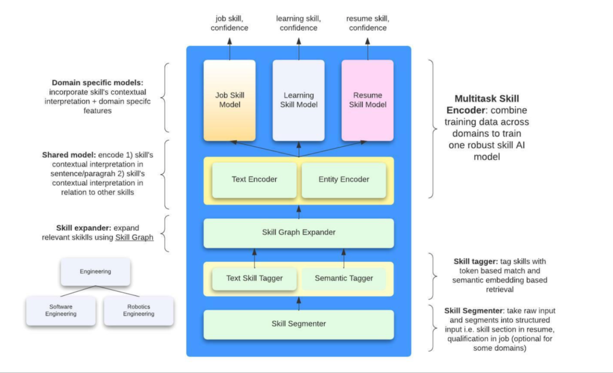

# Skills

This documents LinkedIn's approach to constructing a knowledge graph around skills.

## [November 2022 - Building LinkedIn's Skills Graph to Power a Skills-First World](https://www.linkedin.com/blog/engineering/skills-graph/building-linkedin-s-skills-graph-to-power-a-skills-first-world)

An important model for LinkedIn is the skills graph - it maps `39k skills` over `26 languages` and over `347k aliases`. The components of their structured skills graph:
- `39k` nodes, each of which is a skill
- Each skill has multiple aliases
- Skills are connected via edges which specify a hierarchical relationship. (e.g. `Marketing` is a `parent` of `Demand Generation` which is a parent of `Email Marketing`)

<<Skills Usage>>. Skills are automatically extracted from job postings and member histories. Job postings are allowed to tag up to 10 skills. Users can see something like `4/10 skills match your profile` to help them determine job fit.

The skills graph is constructed both using ML and manual review by taxonomists.

## [March 2023 - Building and maintaining the skills taxonomy that powers LinkedIn's Skills Graph](https://www.linkedin.com/blog/engineering/data/building-maintaining-the-skills-taxonomy-that-powers-linkedins-skills-graph)

This article is more about how the <<Skills Graph>> is constructed.

Each skill node includes the following foundational details (e.g. `Machine Learning`):
- Description of the skill: `the study of computer algorithms...`
- Aliases: `ML, ...`
- Skills type: `Hard` or `Soft`
- Skill ID

Each skill is represented by a `node` in the graph and nodes are linked via edges called `knowledge lineages`. Skills can relate for various reasons. Edges are directed and represent a parent-child relationship (e.g. `Software Development` -> `Back-end Software Development` -> `Python`)

Each node can have multiple parents and/or children. 
- Multiple parents example: Both `Back-end Software Development` and `Mobile Software Development` are parents of `Java`
- Multiple children example: `Supply Chain Management` has children `Supply Chain Engineering`, `Logistics Management` and `Digital Supply Chain`

The hierarchical relationship allows us to enrich skills understanding, since if a person knows a particular skill, we may infer that he knows something about all the parent nodes and perhaps some of the "sibling" nodes.

LinkedIn has certain quality guardrails on the structured skills, one of which is <<discouraging ambiguity>>. For example, an ambiguous skill like `Networking` may be mapped to skills like `Computer Networking` or `Professional Networking`. This type of ambigious relationship is not allowed, and LinkedIn either removes such edges or disallows such a node. The meaning of a phrase is determined by analyzing how the skill is used predominantly in LinkedIn. In cases where a phrase can have divergent meanings, the skill is disambiguated by expanding the phrase. For example, `Cadence` is disambiguated to `Cadence Software` and `Boundary` to `Boundary Line`.

<<Architecture>>. The components to their ecosystem are as follows:
1. <<Human Curated KG>>. Presumably, this is a purely human-curated KG where all nodes and edges are taken as true, and constantly curated by human taxonomists.
2. <<AI-generated KG>>. This is generated using ML models which use the human curated KG as training and validation data. The model behind this is <<KGBERT>>, which will be briefly covered below.
3. <<Serving>>. Both the AI-generated KG and human-generated KG are made available to all LinkedIn services via a REST API for online serving and also on HDFS to power offline inference.

<<KGBERT>> is a model for automatic edge prediction, which can generate the AI-generated KG from the human curated one. The basic idea is that the human curated KG is used to generate training and validation data in the following form:

```
[CLS] Tensorflow [SEP] Machine Learning [SEP] -> label: child - parent
```

Two skills are concatenated to form the context. The skill is represented at random by its `title`, `description` or `title + description`. The context is fed into a BERT model and a linear + softmax layer is attached to the `[CLS]` token to generate a softmax probability over 3 options:
- Parent -> Child
- Child -> Parent
- No relation

The <<positive labels>> are taken from edges in the human curated graph. The <<negative labels>> are generated by some heuristics:
- Skill pairs from different industries
- Niece / Nephew pairs e.g. `Tensorflow` vs `Cognitive Computing`
- Sibling pairs with the same parent e.g. `Tensorflow` vs `Pytorch`
- Loosely related pairs that are 3 or more steps apart

The nice thing about this architecture is the <<clean separation of the human curated graph from the AI-generated one>>. The human-in-the-loop setup allows humans to review the AI-generated graph and add new edges to the human curated graph, which in turn improves the AI-generated graph. This seems superior over mixing both AI-generated edges and human-curated edges in the same graph.

## [December 2023 - Extracting skills from content to fuel the LinkedIn Skills Graph](https://www.linkedin.com/blog/engineering/skills-graph/extracting-skills-from-content)

This post takes a deeper look into how skills are extracted from data by LinkedIn from various contexts, such as job listings or member profiles.

Note that skills can be mentioned either directly or indirectly (e.g. `you are expected to know how to apply different techniques to extract information from data and communicate insights through meaningful visualizations`). Hence, a simple span extraction approach will not be exhaustive in extracting skills. On the other hand, not constraining the problem to span extraction could lead to false positive errors, so our model has to be very accurate.

|  |
| :--: |
| An overview of the skills extraction architecture |

At a high level, the steps are:
1. The <<Skill Segmenter>> organizes the raw text into structured input, e.g. a resume is split into the `qualification`, `career history` etc. sections
2. The next step aims to generate a candidate list of skills from the context:
    - 2a. The <<Text Skill Tagger>> is a trie-based model that simply finds matches in the text that exactly match a node in the Skills Taxonomy. This puts the burden on the Skills Taxonomy to have all the aliases that cover every possible utterance of the skill. However, this model is very fast
    - 2b. The <<Semantic Tagger>> aims to overcome the coverage issues above and uses BERT semantic match to surface more candidates
    - 2c. The skills from 2a. and 2b. are expanded into more skills using the Skills Graph. It seems like they add immediate parents, children and siblings of each skill.
3. Each skill candidate is scored against the context to generate a confidence score. This section has a Shared Model and Domain-specific Model. 
    - The <<Shared Model>> contains a `context-encoder`, which encodes the text surrounding the skill into an embedding, and a `entity-encoder`, which encodes surrounding skills, the job title, etc. All these embeddings are fed as context into the next stage. The Shared Model assumes that the relationship between the context surrounding each skill and the skill itself is constant across the different domains and thus benefit from a shared module. Their AB tests confirm this hypothesis and show that such multi-task training does increase lift in online metrics.
    - Each domain (job posting, member profile, course) has its own scoring model. The embeddings from the Shared Model and each skill candidate are fed into the <<Domain-specific Model>>, which is presumably a form of cross encoder that generate a confidence score for each skill candidate. Finally, some threshold is applied and a final list of skills is generated.

LinkedIn needs to generate skill extractions within `100ms` for a high volume of edits. Hence, they used knowledge distillation to distil the BERT model down 80% in parameters.  

As we can see, the LinkedIn architecture is fairly complex and context specific. A natural question for smaller players is how we can tap on LLMs today to simplify parts of this architecture to achieve comparable performance.

