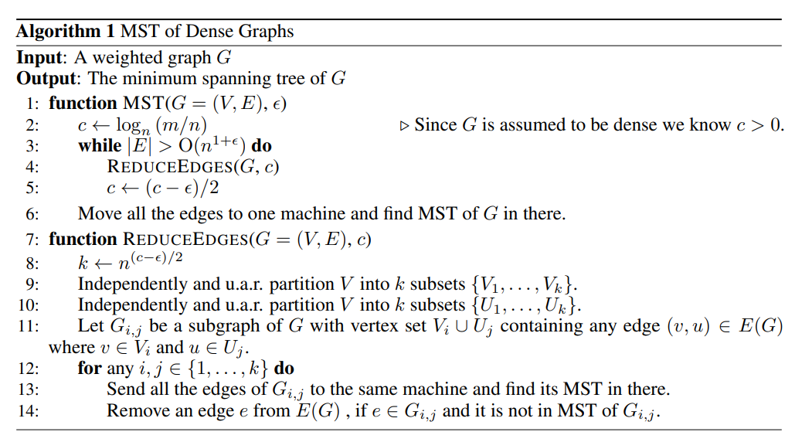

# Bateni 2017 - Affinity Clustering

This paper proposes a hierarchical clustering algorithm which they call "affinity clustering". It is essentially Boruvka's algorithm but with slight modifications, and the main contribution of the paper is a distributed algorithm to perform such clustering at scale.

Much of this paper is devoted to theoretical analysis, but my interest is just in implementing and understanding why the distributed algorithm is correct. 

## Naive Algorithm

Suppose we have an undirected graph $\mathcal{G} = (V, E)$, where $V$ is the set of nodes and $E$ is the set of undirected edges. The naive algorithm for affinity clustering (closely following Boruvka's algorithm) is as follows:
- Start with every node in its own cluster $c_i$, where $i=1, ..., |V|$.
- In each round, find the lowest weighted outgoing edge from each cluster $c_i$ and add the edge
    - i.e. for each cluster $c_i$, find $\argmax_{u, v} \ \{ weight(u, v): u \in c_i, v \notin c_i  \}$
    - Note that this step ensures that the number of clusters at least halves, since each cluster is connected to another cluster
- If the number of clusters becomes lower than $k$, we undo the most recent edge added until we get $k$ clusters
- At the end of each round, we have the desired $k$ number of clusters
- The next round then commences with these obtained clusters

Note that this is essentially Boruvka's algorithm (minus the undo steps), which is guaranteed to find the Minimum Spanning Tree (MST) of the graph $G$. This implies that if we start with $G' := MST(G)$, <<we can run the naive algorithm on the MST $G'$ and get exactly the same clusters as running it on $G$>>, because only the edges in $G'$ come into play when running affinity clustering on $G$. Since the number of nodes in the $G'$ is $|V| - 1$ (by definition of an MST), we would be able to do this efficiently on a single machine (unless |V| is much larger than a few millions).

Therefore, we just need a distributed algorithm to find the MST of $G$ efficiently, and we can perform affinity clustering efficiently.

## Efficient MST algorithm

The main algorithm is the distributed MST algorithm (see below). Some notations:
- $m$ is the number of edges $|E|$, $n$ is the number of nodes $|V|$
- $c$ measures the average density of the graph, i.e. the average number of edges per node. $log_n$ is taken such that $c \in [0, 1]$, where $c=0$ implies that $|V| = |E|$ and $c=1$ implies that $G$ is a fully connected graph.
- $0 < \epsilon < c$ is a density parameter controlling the final number of edges remaining before we run MST on a single machine. We can probably set it to $0.1$ or something like that. A higher $\epsilon$ implies that we can run ReduceEdges for less steps, but we need more memory to run the final round of MST. 

|  |
| :--: |
| Distributed MST Algorithm|