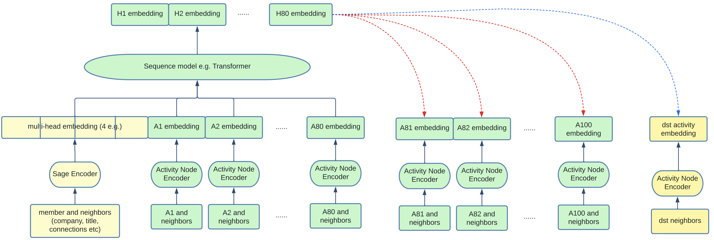

# Borisyuk 2024 - GNN at LinkedIn

[Borisyuk 2024 - LiGNN: Graph Neural Networks at LinkedIn](https://arxiv.org/abs/2402.11139v1)

This is an applied paper documenting learning points from LinkedIn's latest Graph Neural Network (GNN) models, geared toward industry practitioners. 

The main architecture is based on [GraphSAGE](https://ar5iv.labs.arxiv.org/html/1706.02216). The graph is heterogenous, where nodes can represent a company or member or post etc., and edges can represent (i) engagement of a user with a post, (ii) affinity between a member and a creator, and (iii) whether a member or company has a particular attribute. Edges are weighted by the strength of the engagement, except attribute edges which all have a weight of `2.0`.

The GNN's are trained as encoders for the various types of nodes, and the generated embeddings may be used for downstream link prediction tasks. They are trained using the GraphSAGE framework, which inductively generates the node embeddings using graph sampling and neighbourhood aggregation. The graph sampling is powered by the [Microsoft DeepGNN Graph Engine](https://github.com/microsoft/DeepGNN), which is run on a Kubernetes CPU cluster.

## Temporal GNN

One of the main innovations of this paper is to adapt the GraphSAGE framework to the temporal nature of a live recommender system, where items lose relevance very quickly with time and modelling the activity sequence is important.

Firstly, the typical SAGE encoder is applied to the member and its neighbours (e.g. connections, affinities etc.). This generates an embedding of `d` dimensions. Multi-head attention is applied to generate a few of these embeddings, e.g. `H=4`. In addition, sampling of the member's past activities (e.g. N=100) is performed, and each of these activity nodes are also encoded. These are the embeddings labelled `A1, ..., A100` in the diagram below, note that the numbers correspond to chronological order. The input is now of dimension `H+N x d`.

We can see how this now resembles a sequential input embedding (e.g. from text) which is typically fed into transformers and trained with a causal prediction task. Indeed, here we feed the sequential input into a transformer and get an output of `H+N x d` as well (referring to `H1, ..., H80` at the top). Positional encodings are added to the transformer so that the positions may be interpreted as a sequence. Finally, causal masking is used for training the transformer. This means that the first H tokens, no masking is applied, but for the last N positions, each token can only attend to the first H tokens and the activity tokens that preceded it. 

The temporal modelling contributes around 4-5% lift in AUC which is significant.

|  |
| :--: |
| Temporal GNN Framework (Figure 4 from paper) |

## Graph Densification

Since GNNs rely on neighbourhood aggregation, nodes with few interactions pose a cold start problem. To solve this problem, artificial edges are added between nodes with low out-degrees and nodes with high out-degrees based on content-based similarity. Specifically, their algorithm works like so:
1. Nodes with out-degree $\leq$ `30th percentile` designated as low-degree
2. Nodes with out-degree $\geq$ `90th percentile` designated as high-degree
3. Pre-embed all nodes with an LLM based on content
4. For each low-degree node, find its approximate `top-50` neighbours amongst the high-degree set. Create an edge between each of them and the low-degree node with edge weight based on embedding similarity

It seems that graph densification adds a small (0.2%-0.5%) lift to AUC both on offline and online metrics. It probably also increases the diversity of recommendations.

## Personalized Page Rank Graph Sampling

Personalized Page Rank (PPR) is an adaptation of the well-known Page Rank algorithm and is widely used as a notion of node similarity. Specifically, given a source node `s` and a target node `t`, the PPR score $\pi(s, t)$ represents the probability that a random walk originating at `s` will terminate at `t`. 

In training the GNN under the GraphSAGE framework, embeddings of neighbours to a node `s` are aggregated together to form the representation for `s`. A terse way of saying the same thing is that "GNNs propagate signals across graphs". Hence, how neighbours are sampled is crucial in determining the performance of the GNN.

The simple way is <<Random Sampling>>, which simply chooses neighbours randomly amongst nodes connected to node `s`. This can done over a single-hop or multi-hops, and is efficient but not the most performant. The better way is <<PPR sampling>>, which chooses neighbours weighted by their PPR score, with the search space limited to nodes connected to `s` over `k` hops. This is slower but a better measure of neighbourhood. 

From their experiments, 2-hop PPR sampling contributes 2.1% validation AUC lift. Adding more hops beyond 2 hops contributes marginally to performance, hence 2-hops is chosen for efficiency.

## Other Tips and Tricks

The paper is full of practical tips on how to speed up training and improve stability. Here are some that stood out to me:

<<Adaptive Graph Sampling>>. IO time is correlated with number of neighbours sampled. So they start training with a small number of neighbours and increases it only when validation metric starts to stall. It seems that the final number of neighbours is capped at `200`.

<<Mixed Precision>>. Mixed precision (`float-16`) gave roughly 10% speed up in training. But they had to be careful to retain `float32` in the last layer otherwise it degraded the training process. 

<<Data Bound>>. One reflection point they made is that GNN training is generally data-bound rather than compute bound. So the focus on the paper was to make data loading and processing more efficient. For example, they implemented a shared memory queue, and use the `multiprocessing` package to have different processes pre-fetch data from the DeepGNN Graph Engine and pre-process it simultaneously. 

