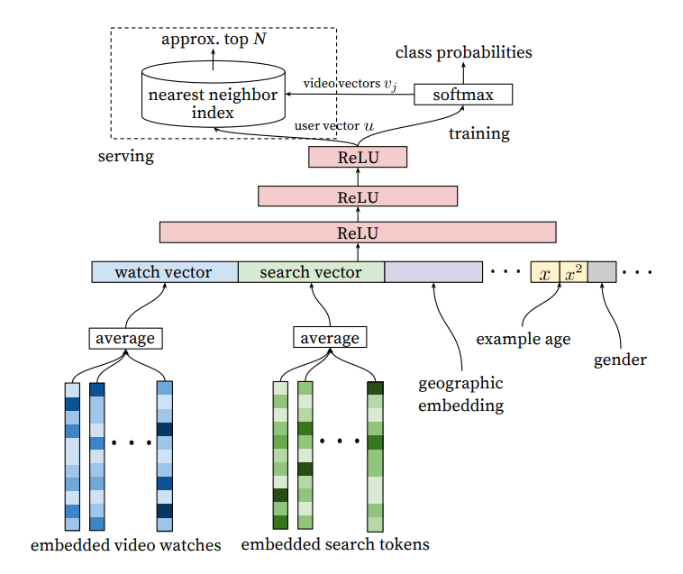
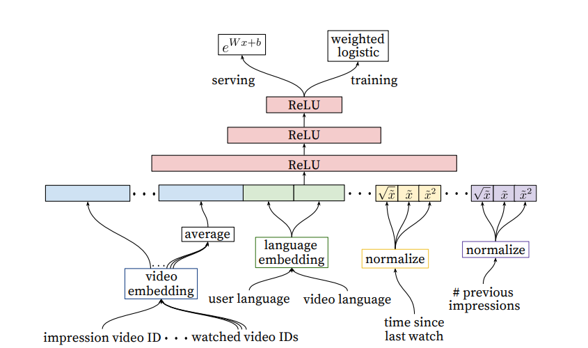

# Covington 2016 - Deep NNs for Youtube Recs

[Deep Neural Networks for YouTube Recommendations](https://static.googleusercontent.com/media/research.google.com/en//pubs/archive/45530.pdf)

This is an old paper that documents YouTube's recommender system, but quite foundational in the Recsys world. This paper also occurs at a time when there was a migration of models into deep learning methods, and Tensorflow was open sourced in the year before. 

## Retrieval

As with most recommender systems, there is a candidate generation and ranking step. The candidate generation surfaces "hundreds" of videos. The predecessor to this work is a matrix factorization approach trained under rank loss (assuming it is [BPR](./rendle_2009.md)). This work may be thought of as generalizing the MF approach to non-linear transformations of arbitrary features.

The paper views recommendation as an extreme multiclass classification problem, where the aim is to predict the probability that the video watch $w_t$ at time $t$ is video $i$. In the below, $V$ is the corpus of videos, $U$ is a specific user and $C$ is a specific context. Also $u, v \in \R^N$ are high dimensional embeddings representing user and item respectively. 
$$
    P(w_t = i | U, C) = \frac{e^{v_i^T u}}{\sum_{j \in V} e^{v_j^T u}}
$$

It is well known that the above is intractable with millions of classes, so this paper samples negative classes from the background distribution and then corrects for the sampling via [importance weighting](./yi_2019.md). This paper samples "several thousands of negatives" for each true label, and then minimizes the softmax loss for the true label against the negatives. <<Note:>> it is not specified what is the background distribution, it could either be a uniform distribution over items or the empirical marginalized impression probability of each item over a fixed time period. Also note that the modern approach is to use in-batch negatives for efficiency, as opposed to the purely random negatives approach here.

At serving time, a fast ANN search algorithm is used to find the top scoring items. This paper used a hashing algorithm in [Weston 2013 - Label Partitioning for Sublinear Ranking](https://proceedings.mlr.press/v28/weston13.html) for this, which is probably an outdated approach today.

### Retrieval: Features

Each user is represented by features such as:
- <<Watch history>>, represented by a variable-length sequence of video IDs. Each video is represented by an embedding, and then the element-wise average is taken such that the whole history is represented by a dense embedding. <<Note:>> this is prior to the attention mechanism, the modern approach is to run the sequence through self attention before taking the element-wise average to get a more nuanced representation.
- <<Search history>>, represented by a variable-length sequence of search terms, treated similarly to watch history. Note that in the experiments, both watch and search history were capped at `50` terms each.
- <<Categorical features>> such as Geographic location are embedded into a dense vector.
- <<Simple binary and float features>> such as gender, log in status are input directly into the network as real values normalized to [0, 1].

The features are all concatenated together to form a long dense vector representing the raw user inputs. e.g. if watch and search history are length $n$, concatenating would give a vector of $2n$ and so on. The dense vector is passed into a fully connected feed forward network with shrinking layers to get a final fixed size dense vector $u$ representing the user. Similar approach is done for items.

|  |
| :--: |
| Candidate Retrieval Architecture|

### Retrieval: Example Age Feature

Since video popularity typically spikes in the first few days after upload and dies down after, an important feature is the "example age" to capture the "freshness" of an item. Since we typically have a training window of several weeks, failing to account for the age of an item would mean that the model will learn to predict the average watch probability of a video over the entire training period. This is not ideal since it makes the model biased toward older videos (which have had more time for exposure) than newer videos. 

The authors correct for this by including the `age of the training example` as a feature during training. Suppose our training window is `90 days`, then this feature would range from `90` (or `1` after normalization) for training examples on the first day of the training window to `0` for training examples on the last day of the training window. At serving time, the value of this feature is set to `0` to reflect the fact that we are making predictions at the very end of the window. The authors show that this approach helps the model learn to predict the time-sensitive effect of popularity for a given item that matches the distribution in the data.

<<Note:>> This is different from incorporating the `age of the item` as a feature during training. I suppose while `age of the item` can capture the same information, it requires more work at serving time, since we need to set the feature value to the actual `age of the item` at the time of serving. In contrast, the above approach allows us to just set the feature to `0` which is more elegant.

### Retrieval: Surrogate Problem

The paper emphasizes that recommendation involves solving a surrogate problem that is then transferred to live inference. Hence care must be taken to ensure that we do not overfit the surrogate problem which can hurt live metrics. Some insights are:
- Generate training examples from all YouTube video watches, not just from YouTube's recommendations, so that relevant videos can be propagated quickly even if they did not originate on YouTube itself.
- Generate a <<fixed number of training examples>> per user, so that very active users do not dominate the loss function. Not sure how this works in practice, presumably a fixed number of examples per user (or just 1?) is sampled for each training epoch. This significantly improved live metrics.
- <<Withhold information from the classifier>>. This is a counter-intuitive point that shows us how tricky it is to find a good surrogate problem. Given the structure of YouTube, users can find videos either from homepage recommendations or from searching for a video. In the latter case, if a user searches for say `taylor swift`, it is typically followed by user watches of `taylor swift` videos. However, we do not want to reproduce this behaviour for homepage recommendations, such that a user is always shown search results based on his / her last search query - this would perform very poorly! Hence the representation of search terms using a simple element-wise average (instead of using a sequence model like RNNs) actually leads to better live results.
- <<Predict the next watched video>>. It is important that training is not performed on random held-out samples, but that the next video is always held out and a "rollback" of features available prior to the video watch is supplied to the classifier. This is because video watching is highly sequential in nature, e.g. episodic videos are watched in sequence and users explore artists starting with the popular videos before moving to niche ones, hence it is important that the surrogate problem captures this behaviour.
    
### Retrieval: Ablation Studies

The paper explored a few settings. At `depth 0`, the MLP simply transforms the dense input vector in one step to the output dimension of `256`, i.e. essentially a linear approach. For `depth 1`, an in-between ReLU layer of `256` is introduced; for `depth 2` in-between ReLU layers of `512 -> 256` is introduced and so on. The performance increases significantly from `depth 0` to `depth 1` with diminishing benefits as we increase the model size.

In terms of features, it is interesting that incorporating searches is very important for performance.
- `Watches only` has MAP of around 6%
- `Watches + Searches` has MAP of around 9%
- `Watches + Searches` has MAP of around 10%
- `All features` has MAP of around 11%

## Ranking

The difference between ranking and retrieval is that ranking aims to specialize predictions to the specific setting in which impressions are shown. In practice, this means that the ranker has access to many more variables about the video and the user's relationship to the video than the retriever. The general architecture for the ranking model is similar to the retrieval model, with the difference that the impressed video is also included as part of the features and the model simply outputs a logit for prediction.

|  |
| :--: |
| Ranking Architecture|

### Ranking: Feature Engineering

Despite the promise of deep learning, this paper found that significant time was still spent engineering features due to the nature of recommender systems. The main challenge for the authors was in representing a sequence of temporal user interactions and how these actions relate to the video being impressed. <<Note:>> The modern approach seems to move away from such intense feature engineering. Instead, the past interactions and video being impressed are simply embedded and passed into a self attention mechanism. The model can then learn interaction features in the hidden layers. The downside of the modern approach is paying higher compute cost at inference time, but it may still be worthwhile given the significant engineering effort required for generating and retrieving hundreds of features manually.

The paper highlighted <<User-item previous interaction features>> as the most important and impactful. This includes features such as:
    - How many videos from this channel did the user watch before?
    - When was the last time the user watched a video on this topic? These continuous features describing past user interactions on related items are especially powerful
    - Features describing number of <<past impressions of this (user, item) pair>> are important for a responsive recommender system. For example, if the user was shown this item many times recently but did not interact with it, the recommender can learn to demote this item so that the user's recommendations can be "refreshed". <<Note:>> For YouTube, they maintain such impression features at up-to-the-second latency because of its importance. For other use cases, a latency of say 15 minutes might still be quite helpful.
    - Feature scores from candidate generation step are also useful

Similar to the retrieval step, categorical features are represented by dense embeddings, with a separate embedding table per categorical feature. The vocabulary for each feature is determined by a single pass over the training data at training time, and the vocabulary size is capped at `1 million` based on impression count. Out of vocabulary values during inference time are simply mapped to the zero embedding. Multivalent features (e.g. a sequence of video IDs for watch history) are averaged element-wise before being concatenated. 

The paper also found that <<normalizing continuous features>> was critical for performance. Specifically, a feature value $x$ with empirical distribution $f$ will be normalized to $\tilde{x} = \int_{-\infty}^x df$, which is the cumulative probability of the empirical distribution up to value $x$. To make it tractable, the authors compute the quantiles of the empirical distribution and do linear interpolation between the quantiles. For e.g. if the empirical distribution of $x$ is `(1, 2, 8, 10)`, then `1` will be mapped to `0.25`, `2` to `0.5` and so on. <<Note:>> this is different from min max normalization, which only uses the min and max value.

### Ranking: Predicting Watch Time

The authors found that predicting watch time instead of a binary watch variable gets much better performance at live metrics. This is incorporated into the model in the form of weighted logistic regression. For positive examples (where the user did watch the video), the example is weighted by the amount of time the user spent watching the video. For negative examples (where the user did not watch), the example gets unit weight.