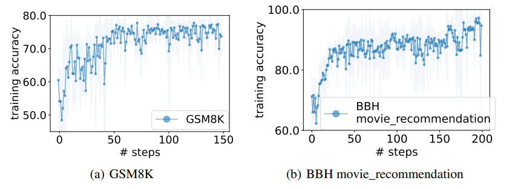

# Yang 2023 - OPRO

[Large Language Models as Optimizers](https://arxiv.org/abs/2309.03409)

This paper proposes an automated prompt optimization technique that resembles optimization. Compared to previous efforts, this paper makes use of an LLM's ability to understand patterns and what they call *optimization trajectories* to optimize a prompt.

## Method

We have access to a training set of `<question, answer>` pairs. The idea is simple:
- Test out a prompt with the task description and evaluate the accuracy
- Append previously tested prompts and its accuracy in an ascending score order (keeping only the best `8` prompts in the trajectory)
- Ask the LLM to write a new prompt that is different from the old ones and achieve a high score

## Motivation

The authors motivate this by showing that LLMs can solve simple linear regression and travelling salesman problems. For linear regression:
- A true generating equation of $y = w_{true}x + b_{true} + \epsilon$ is chosen
- `50` data points are generated with gaussian noise
- The goal is to get an LLM to guess what is the best `(w, b)` pair
- The algorithm loops through the following:
    - Start with `5` random `(w, b)` pairs, compute their mean-squared error
    - Prompt the LLM with these pairs and tell it to suggest `8` new `(w, b)` pairs that further reduces the loss
    - Evaluate the MSE of these new pairs and replace the pairs in the history
    - Keep up to `20` pairs in history

It is not obvious that LLMs can accomplish this task, as it requires some understanding of the underlying generating equation and how to nudge the `w, b` values. However, the paper shows that LLMs can generally solve this task and reach the global optimum, and that better models (e.g. `gpt-4` vs `gpt-3.5`) achieve the optimum in fewer number of steps.

## OPRO for Prompt Optimization

The general layout of a prompt is like so (note that the `Comment`
headers are not part of the prompt):

<pre><code class="language-markdown" style="white-space: pre-wrap;">
### Comment: Meta Instruction for Optimization Trajectory ###
I have some texts with their corresponding scores. The texts are arranged in ascending order based on their scores, where higher scores indicate better quality.

### Comment: Optimization Trajectory ###
text:
Let's figure it out!
score:
61

... more history ...

### Comment: Meta Instruction for Few Shot Exemplars ### 
The following exemplars show how to apply your text: you replace &lt;INS&gt; in each input with your text, then read the input and give an output. We say your output is wrong if your output is different from the given output, and we say your output is correct if they are the same.

### Comment: Few Shot Exemplars ###
input:
Q: Alannah, Beatrix, and Queen are preparing for the new school year
and have been given books by their parents. Alannah has 20 more books than Beatrix. Queen has 1/5 times more books than Alannah. If Beatrix has 30 books, how many books do the three have together?
A: &lt;INS&gt;
output:
140

... more exemplars ...

### Comment: Final Meta Instruction ###
Write your new text that is different from the old ones and has a score as high as possible. Write the text in square brackets.
</code></pre>

Optimization is tested out on GSM8K (grade school math problems) and Big Bench Hard (logical reasoning questions). At each step, the above prompt is used `8` times to generate `8` different prompts. These prompts are evaluated on the training set. The best scoring `20` prompts are kept in the optimization trajectory at any point in time. Other parameters:
- `Temperature = 1` when generating prompts for diversity
- `Temperature = 0` when evaluating each prompt on the training set with the *scorer* LLM for greedy decoding

The optimization trajectory looks like this, resembling actual optimization.

|  |
| :--: |
| OPRO Optimization Trajectory (Figure 1 from paper) |

## Notes

The method is intuitive and compelling. The downside is that inclusion of both optimization trajectory and exemplars makes the method quite costly, although the optimization only needs to be done once to get the best prompt.