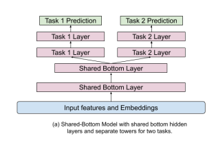

# Zhao 2019 - Recommending What to Watch Next

[Recommending What Video to Watch Next: A Multitask Ranking System](https://daiwk.github.io/assets/youtube-multitask.pdf)

This paper covers Youtube's recommendation system for what video to watch next, given the current video. The main contributions of this paper are:
- Handling position bias
- Multi-gated Mixture of Experts to handle multi-task objectives

## Background

This paper focuses on the ranking task of next video recommendation. There are specific challenges to their setting:
1. <<Multiple signals>>. For each video recommendation, there are <<engagement signals>> such as clicked, duration watched etc., and also <<user satisfaction signals>> such as liked, shared etc. Optimizing for these tasks is potentially conflicting, but multi-task learning also has potential to learned shared representations across tasks.
2. <<Position bias>>. Position bias can degrade recommender performance since it may learn signals irrelevant to relevance. Tackling this issue can lead to online performance gains.
3. <<Large Scale>>. The industry scale of recommending from billions of videos means that training quality might need to be traded off for efficiency. For this reason, the paper opts for a neural network based point-wise ranking model (as opposed to pair-wise or list-wise training methods like InfoNCE). This is also why the paper focuses on an architecture that can efficiently share parameters between different input feature modalities and prediction tasks.

The candidate generation is performed using multiple retrieval models, each of which captures a different aspect. For example, one algorithm matches topics of the query video, whilst another is based on co-watch statistics. A sequence model similar to [Covington 2016 - Deep Neural Networks for YouTube Recommendations](https://static.googleusercontent.com/media/research.google.com/en//pubs/archive/45530.pdf) is also used. The efficient gramian methods in [Krichene 2018 - Efficient Training on Very Large Corpora via Gramian Estimation](https://arxiv.org/abs/1807.07187) was also used.

For ranking, a few hundred candidates are retrieved and passed to the ranker. Point-wise ranking loss is chosen for simplicity and scaleability.

## Mixture of Experts

It is common for ranking systems to have multiple objectives, due to having multiple implicit feedback signals in a recommender system. There are some approaches to deal with this:
- <<Explicitly modelling the relationship between the signals>>. E.g. in [ESMM](./ma_2018.md), the conversion probability head is modelled as a multiplication of the click probability with a separate head. In this way, the conversion head only needs to learn the "delta" signals that cause a click to turn into a conversion. However, such an approach only works when the relationship between tasks is known, and is also not very scaleable when the number of tasks increases.
- <<Shared Bottom Layer>>. The typical architecture is to have a shared representation layer at the bottom (from the inputs), and then to have a task specific head for each task connected to this shared bottom (see figure below). However, such hard parameter sharing has been shown to sometimes harm the learning when correlation between tasks is low.

|  |
| :--: |
| Shared Bottom Architecture|

The mixture of experts architecture proposed is covered in [Ma 2018 - Modeling Task Relationships in Multi-task Learning with Multi-gate Mixture of Experts](https://dl.acm.org/doi/pdf/10.1145/3219819.3220007). The main idea is that we have several expert layers that branch off from the shared bottom, and we also have a gating head (ending in a softmax) for each expert tower. The representation for each task is thus a unique weighted combination (the weights coming from the gating heads) of the expert layers. This somehow allows the model to "distribute work" to different experts to modularize information for each task. Note that the number of experts can differ from the number of tasks.

Specifically, focusing on task $k$, let us denote:
- $x \in \R^d$ as the representation arising from the shared bottom layer
- $f_i(x) \in \R^d$ as the $i^{th}$ expert where $i=1,...,n$. 
    - In this paper, $f$ is simply a sequence of ReLU layers. 
    - Here I denote the expert representation as having the same dimension $d$ for simplicity but that does not need to be the case.
- $g^k_{(i)}(x) \in \R$ is the gating weight for task $k$ from the $i^{th}$ expert
- $g^k(x)$ is the vector form comprising $n$ elements for $n$ experts
    - It is obtained by $g^k(x) = softmax(W_k(x))$
    - Where $W_k \in \R^{n \times d}$ is the gating weights for task $k$
- $h_k$ is a final sequence of ReLU layers for task $k$

Starting from the shared bottom representation $x$, for each task $k$ we perform:
- Obtain the gating weight vector $g^k(x) = softmax(W_k(x))$
- Obtain the weighted representation for task $k$ as $f^k(x) = \sum_{i=1}^n g_{(i)}^k(x) \cdot f_i(x)$
- Obtain the final prediction logit for task $k$ as $y_k = h_k(f^k(x)) \in \R$

We see that this architecture is quite flexible in supporting an arbitrary number of experts and tasks. In contrast to [ESMM](./ma_2018.md), we do not need any knowledge of how the specific tasks relate to each other to specify this network.

The authors mention that in distributed training, there is a danger that the softmax gating network may experience an <<imbalanced expert distribution problem>>, where gating networks converge to have zero-utilization on most experts. They experienced this 20% of the time. To mitigate this issue, dropout is performed on the gating networks by setting the softmax weight for each gate to be 0 with probability `10%`. The softmax vector $g^k$ is then renormalized to sum to `1` after the dropout. With this approach, they completely eliminated the polarization issue. It is not clear whether this issue happens in single-machine training, but nonetheless the fix seems easy to implement and seems like a low-hanging fruit to do.

## Position Bias

A common problem with implicit feedback data is position bias, i.e. the propensity of users to click items in higher positions due to the position rather than the relevance of the item. There are some ways to deal with this:
- Inject the position as an input feature in model training to learn the position bias, and then set this feature to a fixed constant when serving
- Learn the position bias explicitly from offline data or random experiments, then use methods like Inverse Propensity Scoring to regularize or normalize the predictions

The problem with the latter approach is that position bias is dynamic in real world systems, making it cumbersome to separately estimate it. Hence this paper adopts the former approach that is efficient and adapts to training data distribution changes as we train the main model.

This paper treats position bias as a bias term that is added to the prediction logit for each task $k$, before the logit is fed into a final `sigmoid` to generate a click probability. The position bias term is generated by passing the `position` feature and other features like `device info` into a shallow tower. Device info is included because different position bias is observed on different types of devices.

<<Note>>: The paper is not clear on how the position and device are represented as features. Naively, I imagine that a small embedding (say of `dim 32`) is used to encode each position and each device value. Since the position bias is strongest at the top positions, we could cap the number of position embeddings to say `50`, and assign all later positions to the final position embedding. Then, we can concatenate the position and device embedding to form an embedding of say `dim 64`, and feed that into a shallow ReLU layer to generate the position bias logit. Another way is to do element-wise multiplication of the position and device embedding.

## Training

The paper does not provide much detail on how exactly training is performed, but they mentioned that point-wise loss was chosen for simplicity. I would imagine the process to be something like:
- Start with positive training examples where some subset of engagement or satisfaction metric were observed (e.g. user watched)
- For each positive training example, sample one or more random negative(s) from items that were shown to the user in that context but user did not click
- Train the model to predict the multi-task outcome for each of these examples in a point-wise manner

## Experiments

Online experiments were performed on YouTube. AUC was chosen for classification tasks and squared error for regression tasks. 
- The paper found that using the shallow tower for position bias increases AUC by `0.24%`
- The Mixture of Experts approach is better than the shared bottom approach for the same number of model parameters. 

## Takeaways

This paper is scant on details on the actual ranker and features used, but makes a good case for the two proposed components of (i) mixture of experts and (ii) shallow tower for position bias.

