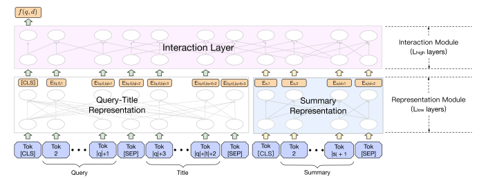

# Zou 2021 - PLM Based Ranking in Baidu Search

[Pre-trained Language Model based Ranking in Baidu Search](https://arxiv.org/abs/2105.11108)

This paper explains how Baidu fine-tunes pre-trained language models (PLMs) to perform efficient ranking for search. Some interesting aspects:
- A quick sentence extractor to perform query-sensitive summarization of documents on the fly
- Calibrating relevance signals for each query-document pair using click features

## Background

The paper highlights some challenges with using PLM-based cross encoder ranking for search:
- Documents tend to be long, making it hard for a ranker to meet the extremely low latency requirements of search. Transformer based models have quadratic time complexity with sequence length, exacerbating the problem.
- PLMs are typically trained on the language modelling task, which does not transfer directly into a query-document pair type of sentence for ranking.
- The score needs to be in a meaningful range to be easily blended with other ranking signals such as freshness, authority etc. <<Note:>> This portion might be specific to Baidu as they score documents in the `0-4` range.

## Problem Formulation

Given a query $q$ and a set of retrieved documents $D = \{ d_i \}^N_{i=1}$, we desire a scoring function $f: \mathcal{Q} \times \mathcal{D} \rightarrow \R$, which maximizes some evaluation metric:
$$
    max_f \ \E_{q, D, Y} \ \Theta(Y, F(q, D))
$$

Where:
- $\Theta$ is an evaluation metric like DCG
- $F(q, D) = \{ f(q, d_i) \}^N_{i=1}$ is the set of document scores for this query
- $Y = \{ y_i \}^N_{i=1}$ is the set of true labels. For Baidu, $y_i$ is in the range `0-4`, corresponding to `bad`, `fair`, `good`, `excellent`, `perfect` respectively.

In learning to rank, we have a set of labelled query document pairs denoted as $\Phi = \{ \phi_q \}$, where $\phi_q = \{q, D=\{ d_i \}, Y = \{ y_i \}, i = 1, ..., N \}$ is a set of labelled documents given a query $q$. We minimize the learn to rank loss $\L$ as a proxy to minimizing the non-differentiable metric $\Theta$:
$$
    \L(f) = \frac{1}{|\mathcal{Z}|} \sum_{ \{ q, D, Y \} \in \Phi} \mathcal{l}(Y, F(q, D))
$$  
Where $l$ is the loss function and $\mathcal{Z}$ is the normalizing factor.

## Query-Weighted Summary Extraction

As mentioned above, documents are typically long and ill-suited for direct inputting into a BERT-based transformer. Thus the authors propose a fast query-sensitive algorithm to select a subset of sentences from each document to serve as the `summary`. The algorithm is as follows:
- Given a query $q$, document $d$, decay factor $\alpha$ and max number of sentences $k$
- Tokenize $q$ into a set of words $W_q$
- Tokenize the document $d$ into a set of sentences $\mathcal{S}$
- Initialize a vector of word importances as $\omega_w$ for $w \in W_q$
- For each sentence $s_i \in \mathcal{S}$:
    - Tokenize $s_i$ into a set of words $W_{s_i}$
    - Compute $score = \sum_{w \in W_{si} \bigcap W_q} \ \omega_w$
- Choose the sentence with the highest score $s^*$ and add to summary
- Remove $s^*$ from $\mathcal{S}$
- Decay used word importances in $\omega$ accordingly, i.e. $\omega_w \leftarrow \alpha \cdot \omega_w$ for all $w \in W_{s^*} \bigcap W_q$

It is a simple and fast algorithm that chooses sentences with the highest word overlap with the query. Each subsequent sentence aims to capture a different set of words by decaying the weights of words already chosen. Baidu chooses $\alpha = 0.5$ and eventually $k=1$ in their experiments.

## Ranking Architecture

The ranking architecture is a simple cross-encoder set up, except that the representation is split up with `query, title` on one side and the query-sensitive document summary on the other side. This avoids incurring quadratic time complexity on the fully concatenated text. In their experiments, they used `9` representation layers and `3` interaction layers, so that the full attention is only done for `3` layers. Baidu estimates that this setup reduces average time by `30%`. 

The representation at the `[CLS]` token is taken and probably attached with a softmax head to perform classification into the `0-4` range.

|  |
| :--: |
| Ranking Architecture|

The model is fine-tuned (the paper calls it pre-training, but I think it's more of a fine-tuning step) using triplet loss on a set of positive and negative pairs. The generation of positive and negative examples is covered below. Specifically, the PLM is fine-tuned to minimize the following loss:
$$
    l(Y, F(q, D)) = \sum_{y_i < y_j} [f(q, d_i) - f(q, d_j) + m]_+
$$

Where $y_i, y_j$ refer to the true labelled score of documents $i, j$ respectively, and $m$ is the margin. 

## Relevance Score Calibration

Naively, we can curate $y_i, y_j$ using clicks and non-clicks respectively. However, the paper highlights several issues with this approach:
- Many clicks are in fact false positives, as they are caused by noisy clicks such as clickbait and accidental clicks
- There is exposure bias in the ranking system favouring higher position items
- Clicks do not necessarily imply relevance

Thankfully, there are many other signals accompanying each `q, d` pair, assuming that sufficient traffic has been observed for such a pair. Some examples from the paper include:
- $\frac{\text{\# click}}{\text{\# skip}}$, which measures the number of clicks vs number of users who were impressed but did not click.
- $\frac{\text{\# click}}{\text{\# total clicks in the query}}$, which measures the number of clicks on the item as a fraction of all other clicks the user made for that query. This helps to control for users who are just trigger-happy and click on many items.
- $\frac{\text{\# long click}}{\text{\# click}}$, which measures the number of long clicks (i.e. user clicked and made no other action for `x` seconds) against clicks.

These features contain signals about relevance that can be combined in a relevance model to infer the relevance of a `q, d` pair. To do this, Baidu crowd-sourced annotated ratings of a score from `0-4` for `70k` query-document pairs. A simple decision tree-based model was then trained to infer the relevance score for a `q, d` pair given the relevance signal features discussed above. After training this model, it is then used to run inference on all `q, d` pairs (with sufficient observed traffic) to predict the relevance label and create a training dataset with a far more accurate relevance label.

<<Note>>: the paper also has a final step of fine-tuning the model according to crowd-sourced data, after the initial fine-tuning phase above with the calibrated relevance scores. Since this part is not particularly innovative nor feasible, I have omitted it here.

## Experiments

They compared these innovations in an ablative manner from the original ERNIE system, which was a 12-layer transformer ranker trained using pairwise loss with human-labelled query-document pairs. The online ablation experiments show that:
- The inclusion of the document summary in the document representation adds around `0.65%` in DCG@2
- The inclusion of fine-tuning on calibrated relevance scores increases the gains to `2.78%`

The ablation experiments also showed that <<calibrated relevance scores is critical>> for effective fine-tuning. By using raw user clicks as signal, the positive-negative ratio (PNR, i.e. ratio of concordant `q,d` pairs over number of discordant `q,d` pairs) was only `1.86`, but with the calibrated scores it increased dramatically to `3.35`.

## Takeaways

This is an interesting paper on building an effective pure search ranker (i.e. no personalization), although we can always layer additional personalization on top of the initial relevance score. The benefit of training a pure search ranker is that we can observe multiple instances of the same `q, d` pair, which allows us to <<bootstrap a diverse array of weaker relevance signals into a much stronger relevance score>>. Even if we do not have human-annotated signals to train the decision tree, we often have a sparser but stronger signal (e.g. conversion) and many other weaker but more abundant signals. Hence, it may be possible to use the same approach to predict the stronger signal from the weaker ones.

I suppose another way to deal with the diverse signal problem is multi-task learning, but this approach allows us to avoid the complexity of multi-task learning by first pre-processing relevance signals.

The idea of a <<on-the-fly query-sensitive document summary>> also sounds useful, and can probably be implemented with the help of ElasticSearch. We could extend this approach by performing query expansion before doing the document summary, which may allow us to fetch more relevant sentences which do not have exact term overlap. Another way of doing this is to pre-generate document summaries using an LLM, which requires assuming that one summary for a document is able to suit all queries, which may not be the case.

