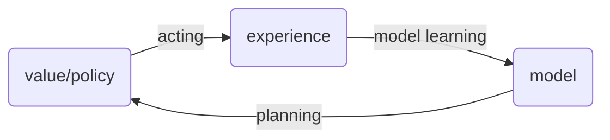
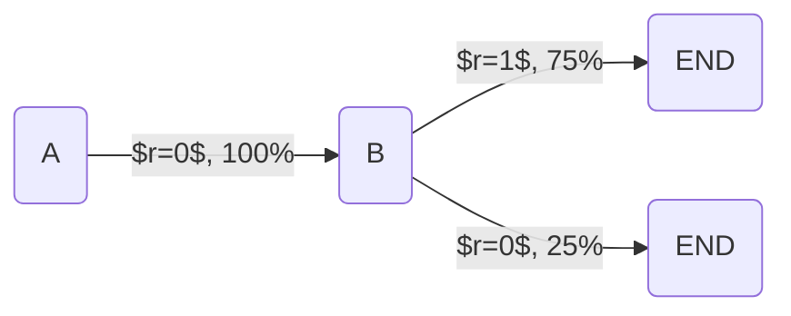
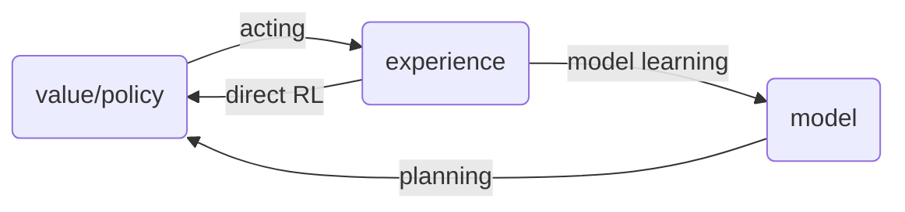

# Learning & Planning

[Lecture 8: Integrating Learning and Planning](https://www.youtube.com/watch?v=ItMutbeOHtc&list=PLqYmG7hTraZDM-OYHWgPebj2MfCFzFObQ&index=8)

A more conceptual lecture. 
- Introduction
- Model based RL
- Integrated Architectures
- Simulation Based Search

## Model Based RL

- Lecture 7: Learn policy directly from experience
- Lecture 4-6: Learn value function directly from experience
- This lecture: learn model directly from experience
    - The model describes an agent's understanding of the environment. 
- Use planning to construct a value function or policy
- Integrate learning and planning into a single architecture

Taxonomy
- Model free RL
    - No model
    - Learn value function / policy function from experience
- Model-based RL
    - Learn a model from experience
    - Plan value function / policy function from model. Use model to look ahead and think and get rewards.

The learning diagram for Model-based RL is as follows:

Advantages of Model-Based RL
- Can efficiently learn model by supervised learning methods
    - Consider a game like chess, where the model and game rule is quite simple
    - But the value function is very hard, because moving one piece can dramatically change the value function
    - So in some cases, the model is a more compact and useful representation of the problem
    - The model simply predicts our next state, given the previous state and action. We can have a teacher which is the environment or game engine.
- Can reason about model uncertainty

Disadvantage of Model-based RL:
- First learn a model, then construct a value function, which gives us two sources of approximation error

## What is a Model?

A model $\mathcal{M}$ is a representation of an MDP $\left< \S, \A, \mathcal{P}, \mathcal{R} \right>$ parametrized by $\eta$.
- Assume state space $\S$ and action space $\A$ are known
- So a model $\mathcal{M} = \left< \mathcal{P}_\eta, \mathcal{R}_\eta \right>$ represents state transitions $\mathcal{P_\eta} \approx \mathcal{P}$ and rewards $\mathcal{R_\eta} \approx \mathcal{R}$
- And we can use the model to sample next state and reward
$$
\begin{align*}
    S_{t+1} &\sim \mathcal{P_\eta}(S_{t+1} | S_t, A_t)\\
    R_{t+1} &\sim \mathcal{R_\eta}(R_{t+1} | S_t, A_t)\\
\end{align*}
$$
- Note that we just need to advance one time step to start learning
- It is typical to assume conditional independence between state transitions and rewards, i.e.
$$
    \mathbb{P}[S_{t+1}, R_{t+1} | S_t, A_t] = \mathbb{P}[S_{t+1} | S_t, A_t]\mathbb{P}[R_{t+1} | S_t, A_t]
$$

## Model Learning

The goal is to estimate the model $\mathcal{M}_\eta$ from experience $\{ S_1, A_1, R_2, ..., S_T \}$
- Observe that this is just a supervised learning problem
$$
\begin{align*}
    S_1, A_1 &\rightarrow R_2, S_2\\
    S_2, A_2 &\rightarrow R_3, S_3\\
    \vdots\\
    S_{T-1}, A_{T-1} &\rightarrow R_T, S_T\\
\end{align*}
$$
- Learning $s,a \rightarrow r$ is a regression problem
- Learning $s,a \rightarrow s'$ is a density estimation problem
- Pick our favourite loss function, e.g. MSE, KL divergence
- Pick parameters $\eta$ that minimize the empirical loss

Examples of models:
- Table lookup model
- Linear expectation model
- Linear gaussian model
- Gaussian process model
- Deep belief network model

## Table Lookup Model

Our model is an explicit MDP, i.e. $\hat{\mathcal{P}}, \hat{\mathcal{R}}$
- We simply count the number of visits to each state action pair, i.e. $N(s, a)$ and record the probability of each resulting $s'$ and mean reward $R_t$:
$$
\begin{align*}
    \hat{\P}_{s,s'}^a &= \frac{1}{N(s,a)} \sum_{t=1}^T \mathbf{1}(
        S_t = s, A_t = a, S_{t+1} = s'
    )\\
    \hat{\mathcal{R}}_{s}^a &= \frac{1}{N(s,a)} \sum_{t=1}^T \mathbf{1}(
        S_t = s, A_t = a
    )R_t\\
\end{align*}
$$
- An alternative to do this in a non-parametric way:
    - At each time step $t$, record experience tuple $\left< S_t, A_t, R_{t+1}, S_{t+1} \right>$
    - To sample model, each time we are in state $s, a$, we randomly pick a tuple matching $\left<s, a, \cdot, \cdot \right>$

## AB Example

Suppose we have $8$ episodes of experience:
- `A, 0, B, 0`
- `B, 1`
- `B, 1`
- `B, 1`
- `B, 1`
- `B, 1`
- `B, 1`
- `B, 0`

From this data, we learn a model using the one-step supervised learning method like so:

## Planning with a Model

Given a model $\mathcal{M}_\eta = \left< \P_\eta, \mathcal{R}_\eta \right>$, now we want to solve the MDP $\left< \S, \A, \mathcal{P}_\eta, \mathcal{R}_\eta \right>$. We can use our favourite planning algo:
- Value iteration
- Policy iteration
- Tree search

One of the simplest approaches is to do <<sample-based planning>>, but also one of the most powerful. The idea is to use the model only to generate samples. We sample experiences from the model:
$$
\begin{align*}
    S_{t+1} &\sim \mathcal{P_\eta}(S_{t+1} | S_t, A_t)\\
    R_{t+1} &\sim \mathcal{R_\eta}(R_{t+1} | S_t, A_t)\\
\end{align*}
$$

We can then apply model free RL to samples, e.g. using
- Monte carlo control
- Sarsa
- Q-learning etc.

Sample based planning methods are often more efficient.
- Sampling from the model is efficient because sampling gives us high probability events, compared to full width look up

## Back To AB Example

After we built the model, we can sample from it, for e.g.
- `B, 1`
- `B, 0`
- `B, 1`
- `A, 0, B, 1`
- `B, 1`
- `A, 0, B, 1`
- `B, 1`
- `B, 0`

Based on this sample data, we apply monte carlo learning, and end up with: $V(A) = 1, V(B) = 0.75$

## Planning with an Inaccurate Model

Given an imperfect model $\left< \mathcal{P}_\eta, \mathcal{R}_\eta \right> \neq \left< \mathcal{P}, \mathcal{R}\right>$, we need to remember that the performance of model-based RL is limited to the optimal policy for the approximate MDP $\left< \S, \A, \mathcal{P}_\eta, \mathcal{R}_\eta \right>$.
- i.e. the model based RL is only as good as the estimated model
- When the model is inaccurate, the planning process will compute a suboptimal policy

Solutions:
1. When model is wrong, use model-free RL
2. Reason explicitly about model uncertainty

## Integrated Architectures

Bring together the best of model-based and model free architectures. We consider two sources of experience:
- Real experience. Sampled from environment (true MDP):
$$
\begin{align*}
    S' &\sim \mathcal{P}^a_{s,s'}\\
    R &= \mathcal{R}^a_s
\end{align*}
$$
- Simulated experience. Sampled from model (approximate MDP):
$$
\begin{align*}
    S' &\sim \mathcal{P}_\eta(S' | S, A)\\
    R &= \mathcal{R}_\eta(R | S, A)
\end{align*}
$$

Some taxonomy:
- Model Free RL:
    - No model
    - Learn value function (or policy) from real experience
- Model based RL
    - Learn a model from real experience
    - Plan value function (or policy) from simulated experience
- Dyna
    - Learn a model from real experience
    - Learn and plan value function (or policy) from real and simulated experience

The dyna architecture looks like that:

> **Dyna-Q Algorithm**
> 
> - Initialize $Q(s,a)$ and $Model(s,a)$ for all $s \in \S$ and $a \in \A(s)$
> - Do forever:
>   1. $S \leftarrow \text{current state}$
>   2. $A \leftarrow \epsilon\text{-greedy}(S, Q)$
>   3. Execute action $A$; observe reward $R$ and state $S'$
>   4. $Q(S,A) \leftarrow Q(S,A) + \alpha [
    R + \gamma \max_a Q(S', a) - Q(S,A)
]$
>   5. $Model(S,A) \leftarrow R, S'$
>   6. Repeat $n$ times:
>       - $S \leftarrow \text{random previously observed state}$
>       - $A \leftarrow \text{random action previously taken in } S$
>       - $R, S' \leftarrow Model(S,A)$
>       - $Q(S,A) \leftarrow Q(S, A) + \alpha [
    R + \gamma \max_a Q(S', a) - Q(S, A)
]$

Note that:
- Step 4 is the standard Q-learning update step
- Step 5 updates the model using simple SGD supervised learning
- Step 6 is the thinking/planning step, where we "imagine" scenarios using our model and update Q $n$ times, without actually moving our agent in the real world

Experiments show that planning significantly speeds up convergence, requiring much fewer exploration steps in the real world to converge. So we are squeezing much more information out of what we have explored so far.

A variation to Dyna-Q is Dyna-Q+, which puts higher weight on unexplored states and encourages exploration.

## Simulation Based Search

Two key ideas: sampling and forward search.

<<Forward search>> algorithms select the best action by lookahead. A search tree is built with the current state $s_t$ at the root. We then use a model of the MDP to look ahead. 

So we do not need to solve the entire MDP, just the sub-MDP starting from the current position. Solving the entire MDP is a waste of time. Note that this is in contrast to the Dyna-Q algorithm, where the "thinking" step starts by randomly visiting a previously observed state.

So we can <<simulate>> episodes of experience from now using our model, and apply model free RL to simulated episodes.

<<Simulation based search>>:
- Simulate episodes of experience from now with the model
$$
    \{ s_t^k, A_t^k, R_{t+1}^k, ..., S_T^k \}^K_{k=1} \sim \mathcal{M}_v
$$ 
- Apply model free RL to simulated episodes
    - If we use Monte-carlo control, we get <<Monte-Carlo search>>
    - If we use Sarsa for control, we get <<TD search>>

### Simple Monte Carlo Search

- Given a model $\mathcal{M}_v$ and some simulation policy $\pi$ (how we pick actions in our imagination)
- For each current action $a \in \A$:
    - Simulate $K$ episodes using model from current real state $s_t$
    $$
        \{ s_t, a_t, R_{t+1}^k, S_{t+1}^k, A_{t+1}^k, ..., S_T^k \}^K_{k=1} \sim \mathcal{M}_v, \pi
    $$
    - Note that after current $a_t$, we follow policy $\pi$ for future actions
    - Evaluate actions by mean return (Monte Carlo evaluation)
    $$
        Q(s_t, a) = \frac{1}{K} \sum_{k=1}^K G_t \rightarrow q_\pi(s_t, a)
    $$
- Select current real actions with maximum value
$$
    a_t = \argmax_{a \in \A} Q(s_t, a)
$$

### Monte Carlo Tree Search (Evaluation)

MCTS differs in that we allow the policy to improve within our simulation (i.e. policy $\pi$ is not stationary within our simulation runs).

- Given a model $\mathcal{M}_v$
- Simulate $K$ episodes using model from current real state $s_t$ using current simulation policy $\pi$
$$
    \{ s_t, a_t, R_{t+1}^k, S_{t+1}^k, A_{t+1}^k, ..., S_T^k \}^K_{k=1} \sim \mathcal{M}_v, \pi
$$
- Build a search tree containing visited states and actions from the above simulations
- Evaluate states $Q(s, a)$ by mean return of episodes starting from $s, a$ (i.e. monte carlo evaluation)
$$
    Q(s, a) = \frac{1}{N(s, a)} \sum_{k=1}^K \sum_{u=t}^T \mathbf{1}(S_u=s, A_u=a) G_u \rightarrow q_\pi(s, a)
$$
- Note that:
    - $N(s,a)$ is the number of times we visited the $s, a$ pair during our simulations.
    - We are assuming our model is good enough so that we can rely on the simulated returns
    - We are not really learning a persistent Q function. At each step, we run simulations to get fresh estimations of the Q values
- After the search is finished, select the current real action with maximum value in the search tree
$$
    a_t = \argmax_{a \in \A} Q(s_t, a)
$$

In MCTS, the simulation policy $\pi$ actually improves.
- Each simulation comprises two phases (in-tree, out of tree)
    - Tree policy (improves): pick actions to maximize $Q(S, A)$ by looking at the search tree and the node's children
    - Default policy (fixed): in our simulation, when we run beyond the frontier of the search tree, we will pick actions randomly
- Repeat (each simulation)
    - Evaluate states $Q(S, A)$ by monte carlo evaluation
    - Improve tree policy, e.g. by $\epsilon$-greedy$(Q)$
- Essentially, this is monte carlo control applied to simulated experience
- This method converges on the optimal search tree, i.e. $Q(S, A) \rightarrow q_*(S,A)$

## Case Study: Game of Go

Position evaluation in Go:
- How good is a position s?
- Reward function (undiscounted):
$$
\begin{align*}
    R_t &= 0 \text{ for all non-terminal steps } t < T\\
    R_T &= \begin{cases}
        1 \text{ if black wins}\\
        0 \text{ if white wins}
    \end{cases}
\end{align*}
$$
- Policy $\pi = \left< \pi_B, \pi_W \right>$ selects moves for both players
- The value function (how good is position $s$):
$$
\begin{align*}
    v_\pi(s) &= \mathbb{E}_\pi [R_T | S=s] = \mathbb{P}[\text{Black wins} | S = s]\\
    v_*(s) &= \max_{\pi_B} \min_{\pi_W} v_\pi(s)\\
\end{align*}
$$

How does simple monte carlo evaluation work?
- Suppose we start with a certain board configuration $s$
- We simulate many runs of games starting from $s$ with current policy $\pi$
- The value function $v_\pi(s)$ would be the fraction of simulated games where black wins

How then does monte carlo tree search work?
-
