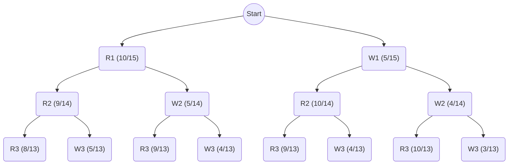

# Conformal Predictions

## Exchangeability

In this section we discuss the difference between independence and exchangeability.

> **Definition**. Independence.
> 
> Two events $A$ and $B$ from a sample space $S$ are said to be independent if $P(A \text{ and } B) = P(A)P(B)$.

If $P(B) > 0$, it is equivalent to say $P(A|B) = P(A)$, since:
$$P(A|B) = \frac{P(A, B)}{P(B)} = \frac{P(A)P(B)}{P(B)} = P(A)$$

> **Definition.** Exchangeability
> 
> Two events $A$ and $B$ are said to be exchangeable if $P(A_1=a, A_2=b) = P(A_1=b, A_2=a)$, which means there is indifference with respect to the order of events.
> 
> More generally, exchangeability of a sequence of events $A_1, ..., A_n$ means that the joint distribution is unchanged when we permute the order of events:
$$
    P(A_1, ..., A_n) = P(A_{\sigma(1)}, ..., A_{\sigma(n)}), \text{ for all permutations } \sigma
$$

The simplest way to understand is to use the example of drawing balls from an urn *without replacement* (example taken from Cordani 2006). Suppose we have an urn with `10 red balls` and `5 white balls`. Then the following tree shows the draw probabilities at each step:

Suppose we 

## References

- [Cordani 2006 - TEACHING INDEPENDENCE AND EXCHANGEABILITY](https://iase-web.org/documents/papers/icots7/3I1_CORD.pdf)
- [Tibshirani 2023 - Conformal Predictions](https://www.stat.berkeley.edu/~ryantibs/statlearn-s23/lectures/conformal.pdf)
